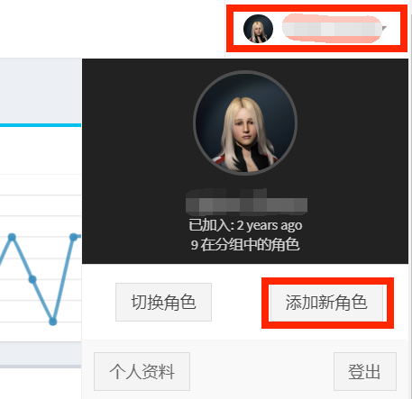

# 4.提交SSO

相信你在数不清的招新广告中频繁看到SSO和ESI这两个不知道意思的英文缩写。

这是00联盟都会用的管理工具，相当于在联盟报个到，提交了SSO，你才算真正加入了公司，进入了联盟。 

在SSO网站中，你能够看联盟的配置，参与活动的记录（PAP），联盟活动中被击毁后申请补损（SRP）。

对于**第一个角色**：
* 打开网页[**https://seat.winterco.org/**](https://seat.winterco.org)
* 登录你的eve账号
* 会看到一个很长的页面，选好你的角色，拉到最下面，蓝色按钮 AUTHORIZE

  

* Ok，完成了，请在群里告诉我们，你提交了SSO！

对于**第N个角色**：
* 打开SSO网站，点击右上角头像，添加新角色

  

* 登录要登记角色对应的账号，选择对应角色，点击蓝色按钮 AUTHORIZE

