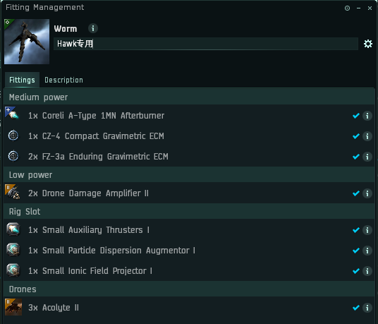
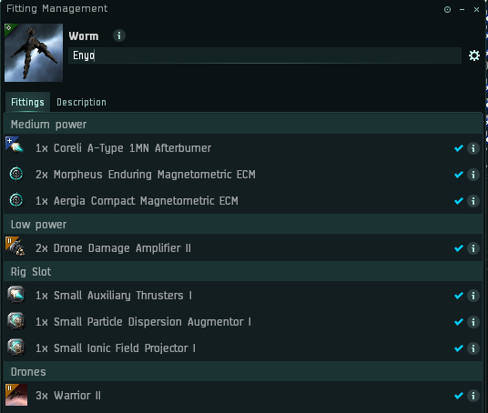
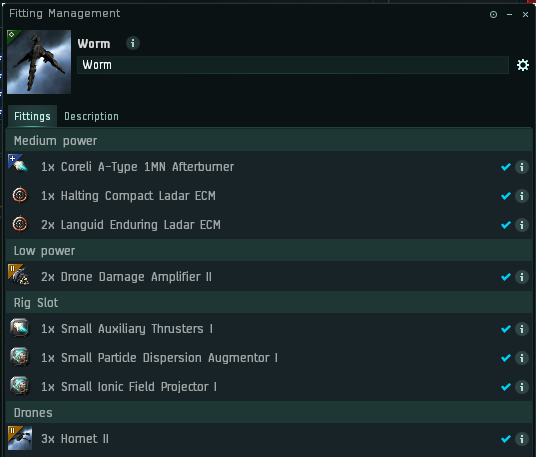
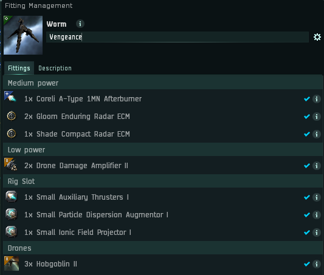
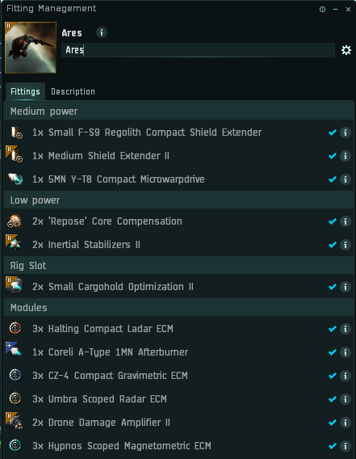
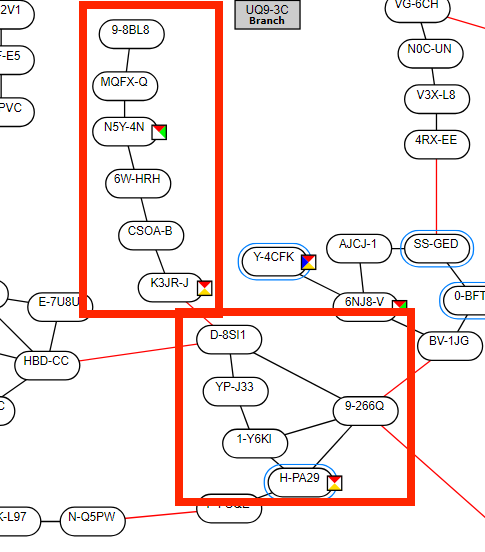

# 9.燃烧任务

****
**燃烧团队**
* 最简单的燃烧任务

* 任务有轨道，进轨道后，1boss，2后勤（如果不能分辨哪个是boss，观察船名，2后勤船名相同）
****
* boss有4种船型:
  * A族 Vengeance
  * C族 Hawk
  * G族 Enyo
  * M族 Jaguar(速度最快，速度要求1200+)
****
* 针对换装：
  * 针对Hawk:
  * 针对Enyo:
  * 针对Jarguar:
  * 针对Vengeance:
****
* 单开打法，推荐**潜龙**
  * 进轨道，boss和后勤会接近你
  * 打开AB，与boss**保持距离**30km，对boss使用ecm
  * 正常情况：
    * Ecm生效，boss会转身向反方向移动，后勤继续接近你。此时Boss与后勤拉开距离，放出无人机**直接打boss**，2轮连续生效的ECM，就足够打死boss了
  * 特殊情况：
    * 多次ECM不生效，则boss被E中时，可能不会反向移动。此时建议：**环绕Boss30km**，ecm命中，放出无人机**打后勤**。清理掉后勤后，再打boss
  * 注意事项：
    * 无人机使用被动模式，ECM命中，放出无人机打，ECM结束，酌情收回无人机
    * Jaguar速度快，需要开推后1200+，推荐1250+
    * 全程距离抗，正确操作，不会掉血
    * 如果放弃Jaguar任务，可以使用T2AB降低成本
    * 船体需要**保持永动**
    * 中槽ECM装备可以根据市场情况选择

  ****
* 双开打法，**小胖子+狮鹫**，成本更低
  * 委曲小胖子，低槽DDA距离抗
  * 委曲狮鹫，ECM
  * 燃烧团队效率瓶颈在于ECM命中率不高。狮鹫有ECM加成，因此效率高于潜龙
    
****
****
****
**铺船大法**
* 名词解释：在可能的任务星系的建筑中准备一套任务船。接到任务后，截击跑路，到达任务星系换船完成。截击回去交任务
* 优点：避免风险，安全跑路，不怕堵门
* 燃烧团队铺船法：
  * 空船带插潜龙
  * 一条装带着装备的跑路截击**（4族T2截击，各3架）**
  * 需要铺船的星系（N5Y本地极低概率）