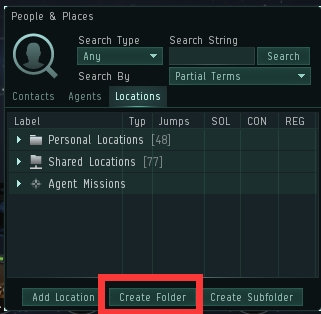

# 3.死亡交易

当你前期刷出10-10，也就是异常打完时出现弹窗。卖掉换钱是个不错的选择。 

具体流程： 

          1.  打开社交，新建一个访问列表，通过这个列表，你可以共享你的做的标记点给别人

         

          2.  alt+e打开人物与地点，新建文件夹

         选择共享文件夹，下面的权限设置为刚刚你新建的访问列表（等你熟练了可以新建多个列表，另外配置权限）

          3.  换上便宜的跑路船，到目的地，跳到轨道，**右键轨道，**保存轨道位置到刚刚新建的**共享文件夹**

          4.  加入死亡交易频道（交易频道在公司置顶中找到） 

          5.  按照频道要求，拖出星系黄字，标清10-10，剩余时间，价钱，等第一个打1的人。

          6.  把打1的人加入到你的访问列表中（打开访问列表，把他的名字拖进来）

        7.   最后一步就是拖着他的名字到上面的第二个图标上，也就是给他管理员权限。这样他就可以把这个点拖走了

第一次卖10-10会稍微麻烦一点，等人家打钱给你，然后把点拖走了，就可以打开列表把刚刚的买家从列表中移除。这样，同一个列表就可以反复使用了。以后再卖10，就只需要把点存进去，拉新的买家进来，完成交易，把人删掉！

