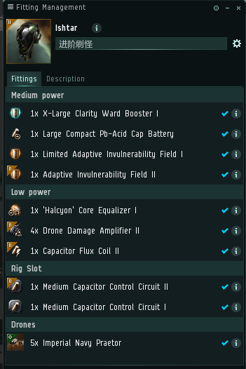
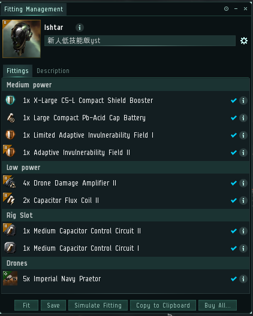
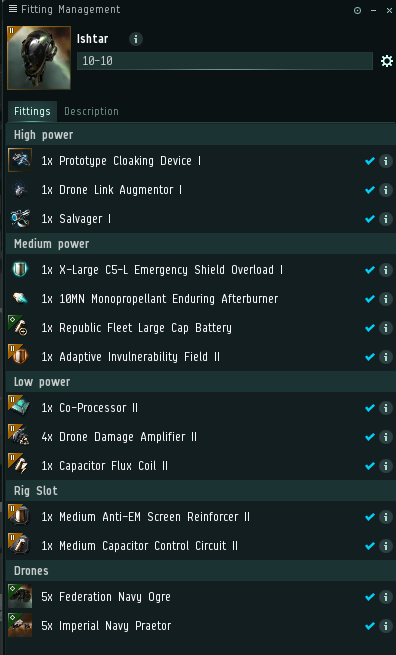

# 4.进阶新船

当你能够gila熟练刷怪之后，我们为你选择了一条进阶船伊什塔ishtar（也就是yst）

标准挂机配置在军团配置中可以查到

我们要求船在主动装备全开的情况下能够永动，考虑到新人技能比较低，可以尝试下面这个配置\(请尽快向上图中伊师塔过渡，更安全\)

换装之后也可以打无人机10-10 速度不快，胜在便宜，3亿出头刷爆10-10！ 

视频教程：[https://www.bilibili.com/video/av25413185](https://www.bilibili.com/video/av25413185)   感谢UP主无私奉献

养生去挂异常，想肝去刷10-10。

