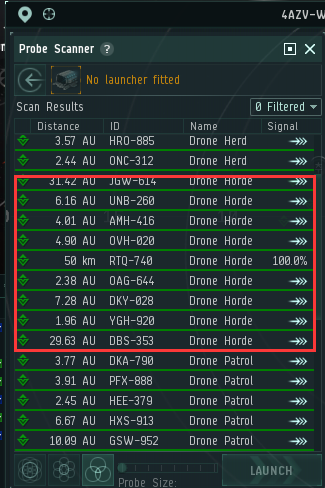
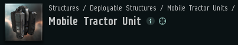

# 2.打捞残骸

打捞是一个非常适合新人赚钱的路子，收益还是不错的，只是不能挂机，没那么安逸。

但是要求也更低，新号挂一会儿技能就可以上打捞促进了！

具体打捞流程：

1. 进一个刷怪量比较多的星系，本地问一下有没有打捞的同行，免得撞车耽误效率
2. 记录打捞点：

   a. 方案一：打开舰载扫描，保存所有无人机群位置哪个消失跳哪个

       b. 方案二：加入报点频道，看大航驾驶员报点，然后保存，他报下一个，就跳点打捞

  3. 落地放置MTU，就是这个东西，他会把散落的残骸拉到一起，方便你打捞

  4. 锁定残骸，打开打捞器！

建议：多准备几个MTU，同时在多个点，部署MTU，牵引残骸（记得保存MTU的位置哦，别弄丢了）

