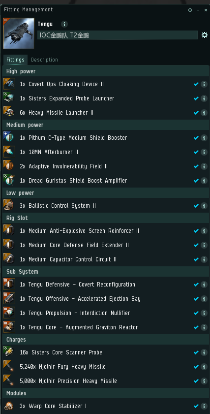

# 5.信号小死亡

**独立 independence** 

第一层，直接冲轨道，打掉网子和反跳小怪 

第二层，落地环绕信标，可站撸，打掉正中间Drone Bunker旁边的3个战列，打完后刷出第二波，摸一下战列，刷出boss

可能触发远征：无人轮盘赌

**眩光 radiance** 

第一层，落地冲轨道，打掉网子怪和反跳小怪 

第二层，落地开推接近警告牌Warning sign，15km左右刷出一波巡洋战巡，7艘，打掉这7个，刷出boss （如果继续接近告示牌，会继续刷怪，混入上一波中，影响锁定。记不清是哪几个是第一波时就一直打巡洋战巡，直到刷出boss）

可能触发远征：换羽之季

**等级制度 hierarchy** 

第一层进轨道，落地朝轨道加速，全清2波，全程朝向轨道，改变朝向会刷出第三波小怪 

第二层，落地开推接近警告牌Warning sign，40KM左右会刷出护卫级小船，摸一下，刷出第二波巡洋，摸一下，刷出第三波战列，摸一下，刷出第四波战列， 只打Alvus ruler 和Supreme Alvus Parasite，总共3-4个，打完出boss 接近警告牌刷出第一波怪后开始环绕信标，伤害比前两个高

可能触发远征：天堂的动乱

视频教程：[https://www.bilibili.com/video/av48077200](https://www.bilibili.com/video/av48077200)    感谢UP主无私分享

金鹏使用**电伤重导**，战列使用**电伤愤怒**，其他**电伤精准**

刷出boss时，有几率出远征，远征**无轨道**，落地隐身做点，或者开蛋进去做点，然后跳点70，直接打boss。如果装备很好请无视这些操作，直接撸boss。 boss死后有几率继续刷出新的远征，同样操作，继续。**打捞件很值钱**

推荐配置IOC金鹏队专用，T2金鹏

