# 7.种菜


**行星开发需要的技能：**

         ****指挥中心升级理论\(影响在行星上造东西的数量\) 

         行星统筹管理学（球的数量）

         行星学  高级行星学（这两影响采集测量的精准度）

         遥测感应技术（不知道是啥大概也是精准度）

**以下的种菜方式都是以指挥中心升级理论，**

        行星统筹管理学4级

        行星学起码要3级

        高级行星学3级（但是哦你行星学3级是没办法点高级行星学的，自己看着办）

        遥测感应技术3级吧毕竟不知道有没用

**p0篇**

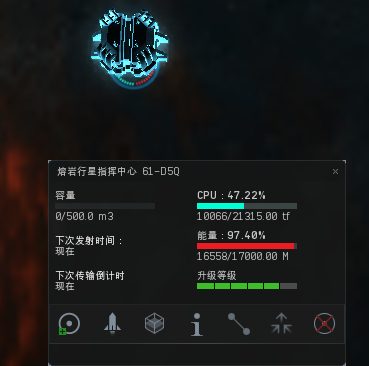

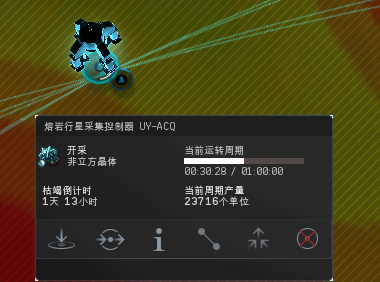

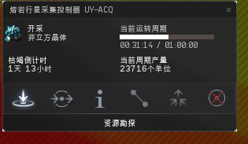

\*\*\*\*

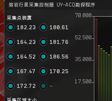

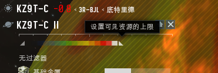

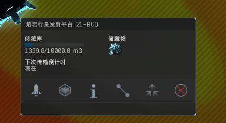

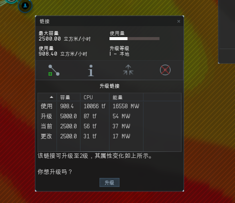

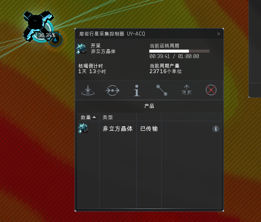

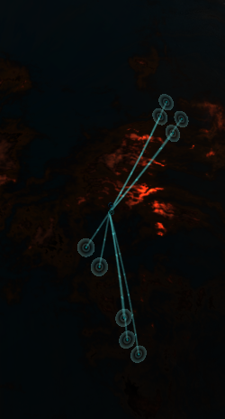

**P1篇**

对于5球来说3p0球 2P1球我觉得是比较好的，好了正式开始P1球

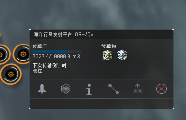

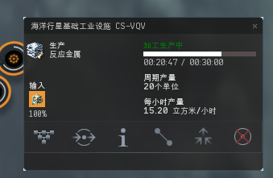

发射中心，基础工厂链接起来，工厂第一个有个加工方案

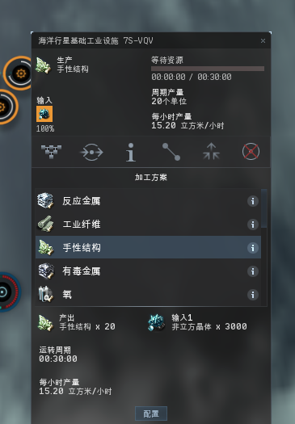

配置需要的P1产物

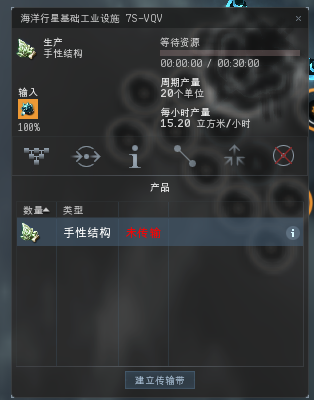

点上面这个未传输的产品，建立传输带到你需要出来的发射中心

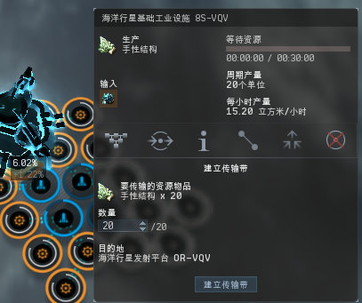

建立传送带，每个工厂都要这样弄

这个是最终的样子吧，看你自己怎么排列，我这里是哪个发射中心供给哪几个工厂就哪几个工厂做出来P1回来哪个发射中心。

