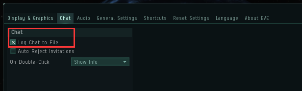

# 5.预警软件

当开着狂怒，边看电影边挂机的时候，突然跳出几个红名大汉把你捶了，怎么办？

切屏回来发现蛋都碎了，怎么办！ 

这个时候，你需要的是预警！

在敌人接近前就获得消息，做好准备！ 

操作很简单！ 

1. 加入**预警频道** \(wc.vale\)，公司置顶可以找到

2. 勾选设置，将聊天记录存至本地

3.下载预警软件（群文件中）并配置 

预警软件常用的有两款Vintel，near2 选择你喜欢的

大致说一下预警原理：

* 勾选了2的设置后，频道的聊天记录会被保存电脑本地的文件中，预警软件会去读预警频道的信息，然后根据与你所在星系的距离，决定是否预警。所以，为了预警频道更可靠，请根据预警频道要求汇报你见到的敌对。**我为人人，人人为我**

根据教程配置：

* [Vintel配置视频教程](https://www.bilibili.com/video/av16471586)

* [Near2配置视频教程](https://www.bilibili.com/video/av20657898)

