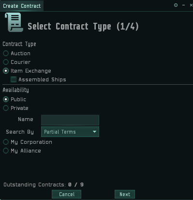
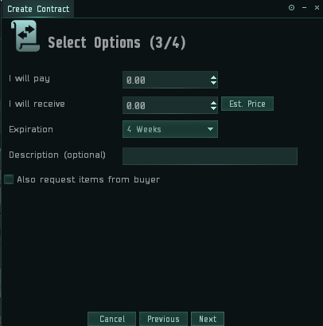

# 1.合同

合同是宇宙中最常用的交易方式

也是最灵活的交易方式

快递合同在本章第3节有详细介绍
这里重点讲Item Exchange合同

**合同类型 Contract Type：**
* Aution——拍卖（较少使用）
* Courier——快递（详见3）
* Item Exchange——交换

**可用类型 Availability：**
* Public
  
  公开合同，全宇宙可见，可接（**注意，公开合同手续费最贵**）
* Private
  
  私人合同，指定的玩家，公司，联盟可接
* My Corporation
   
  本公司，当前角色所在公司全部成员
* My Alliance
   
  本联盟，当前角色所在联盟全部成员  

* I will pay

  付钱数
* I will receive

  收钱数，如果是卖东西，就在这里填上价格
* Expiration

  有效期，合同有时间限制，这里填上时限（时限与合同手续费无关）
* Description

  描述，合同简介，选填  
* Also request items from buyer
  
  从买家处要求物品，方便以物易物（一般不用，不勾选）

**强调：**
  **公开合同手续费贵，多使用私人合同，公司合同，联盟合同**
  