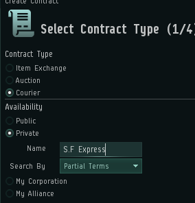
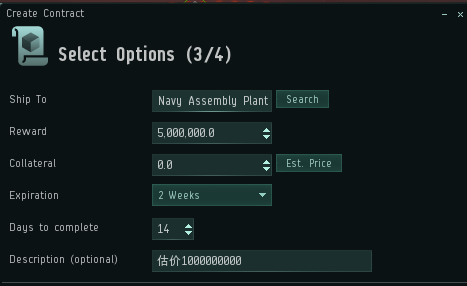

# 2.快递

欧服最大的市场在jita，而我们在00，物资怎么运送呢？ 

联盟早就为你准备好了快递员，帮你跑腿运送物资！
   
1. 首先全选所有你想快递的物品

2. 右键Create Contract，创建合同，选择合同类型为Courier 

3. 接着选择private（私人），然后填写社区快递公司的名字S.F Express

4. 点击Est.Price，获得快递估价，这也是保证金，如果快递翻车，你会收到Collateral金额的赔偿金。
   
5. 打开[**联盟快递计算器**](https://platos.gitee.io/s.f-express-calculator/)，在网页端填写快递信息路线，体积，保证金，来计算快递费
6. 在Ship to里填上目的地

   Reward中填写快递费（5中计算获得）

   Expiration里选择：2 Weeks 

   Days to complete里填入：14
   
   最终结果如下，然后寄出
   

最后，也是最重要的，再次确定，**不要把合同挂公开**，**不要把合同挂错公司！**，**必须填写对应的保证金**

