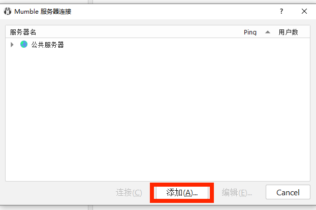
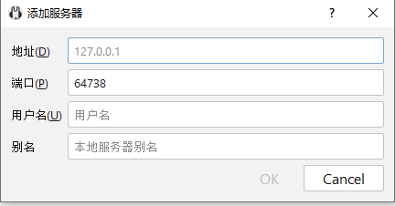
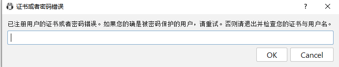

# 3.配置mumble

mumble是我们使用的语音软件，类似于国服常用的YY

跟队之前一定要先配置好mumble，并关闭麦克风

1. 在公司群文件下载搜索mumble，下载时间最近的安装包
2. 安装mumble
3. 打开[seat网站](https://seat.winterco.org),点击左侧mumble登录凭据
   
   
4. 点击添加服务器
   
   

   根据seat内容填写
   
   
   
   点击连接后弹出，此处输入密码

   

5. 具体配置过程请参考：
[**mumble配置教程（感谢FRT伏羲公司）**](https://frt-fuxilegion.gitbook.io/project/di-jiu-bu-fen-you-xi-wang-ye-he-lian-meng-gong-ju-de-shi-yong-zhi-nan/guan-yu-mumble-ya-li-ce-shi)

