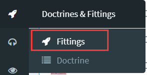
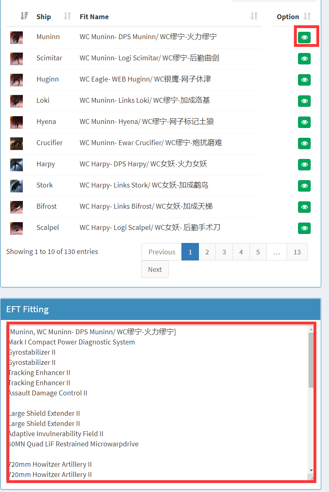
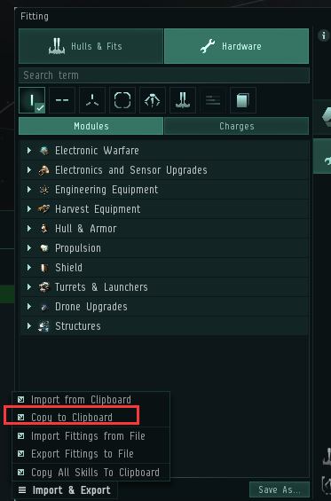

# 2.准备战舰

当你能够在00地区生存下来之后，就要开始按照联盟标配开始准备战斗船

战斗才是这个游戏的乐趣

现在联盟常用的制式船：

             护卫级：新手磨难，女妖

             巡洋级：新人后勤镰刀，缪宁，银鹰，曲剑

             战巡级：猛鲑

使用seat网站，打开fittings

找到要找的船型，点击绿标打开配置，复制红色框中全部内容

打开舰船模拟，导入刚刚复制的配置，检查技能，是否永动。

依照配置，买好战船放在集结点（RF-X7V星城）

看到集结群发出消息，赶来集结点，上mumble进入对应舰队频道，换蛋，上对应船，检查保险，进组听命令准备出发！

紧张激烈的战斗在等待着你！

