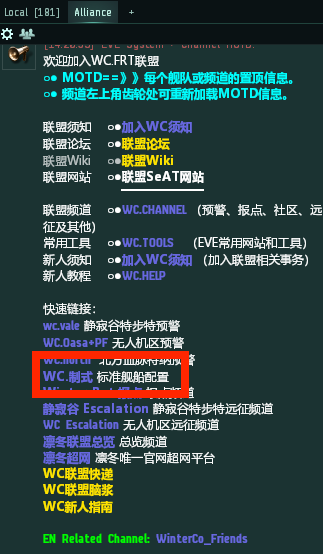

# 2.准备战舰

当你能够在00地区生存下来之后，就要开始按照联盟标配开始准备战斗船

战斗才是这个游戏的乐趣

WC是一个成熟的联盟群，联盟会选择当前版本最强的战舰作为制式船

打开联盟频道置顶信息，进入WC.制式频道，查看当前联盟制式。

根据集结群信息或咨询老玩家，选择当前最常见的制式舰队，**自行购买**舰队中你能驾驶的战舰（联盟合同/市场一键购买），并配置好，**放置在集结点**。

* 看到集结群发出消息
* 赶来集结点
* 上mumble进入对应舰队频道
* 换蛋，上船，检查保险
* 进组听命令准备出发！

紧张激烈的战斗在等待着你！

