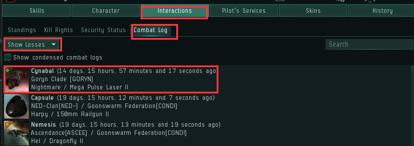
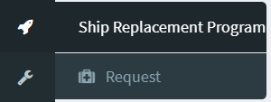
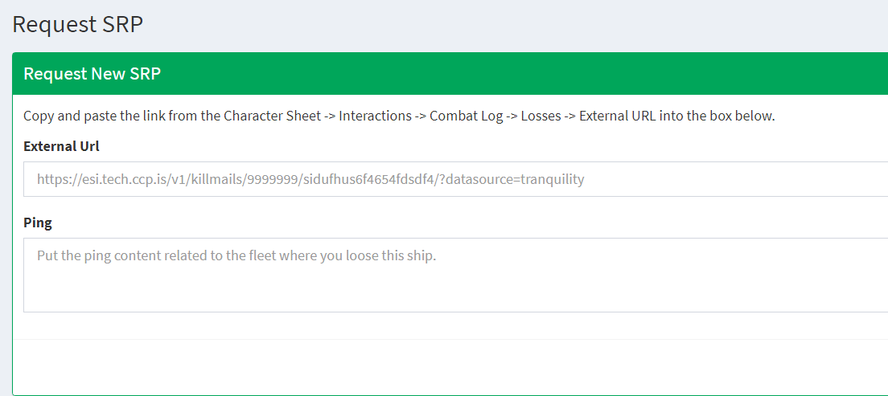

# 4.补损

打架肯定是会有损失的吖！

船炸了怎么办呢？

来来来，船炸了我们有补损！

========================================================================

**一、联盟级补损**

打开你的角色页面，在下面这个位置找到你的损船记录，右键复制外部击杀链接 copy external kill link

打开seat，找到ship replacement Request

在External Url中粘贴你的链接，在ping中填写，你参与的这次活动的起队信息，然后验证提交

然后默默等待。联盟补损官处理的记录会非常多，所以不要着急。

========================================================================

**二、公司级补损**

加入IOC-A SRP邮件列表

发出你的KB，公司会再给你额外的一份补损！

（只补主动PVP，PVE损失请自理）

**保险金+联盟补损+公司补损，保你打架无忧！**

